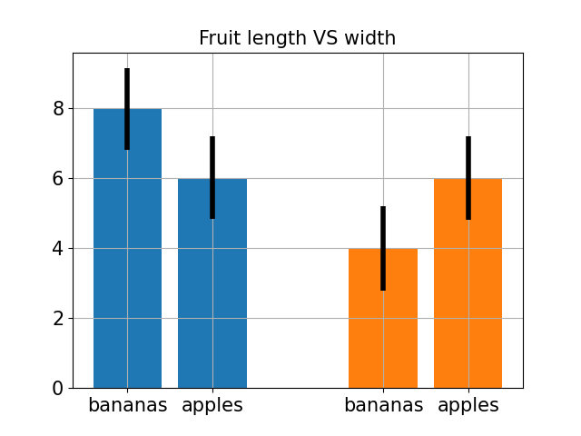
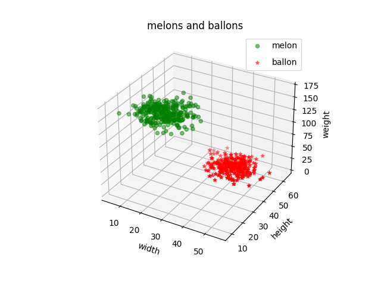

## How to install
for install all of them run following to commend:

```
pip install -r requirements.txt
```
## How to Run
execute this commend in terminal:
```
python main.py
```
⚠ First,got to the desired file.
## Result
### apples bananas 



To see the rest of the results,go to the output file.
### california_cities


### melons_and_ballons




