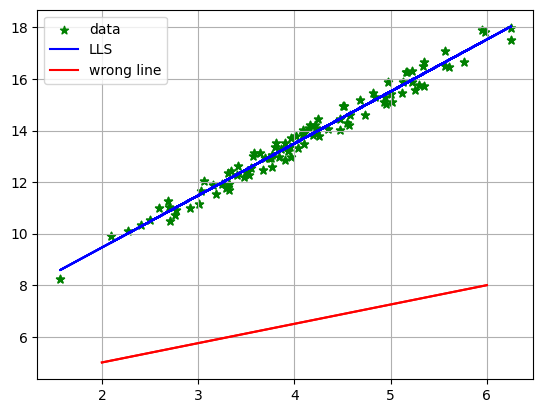

# part_1
Students Performance (Regression)
## How to install
for install run following commends:
```
pip install -r requrirements.txt
```
## How to run
execute this commend in terminal:
```
main.ipynb
```
## result



Draw some wrong ***red*** lines with a random slope.

Draw the correct ***blue*** line using your Object Oriented Linear Least Squares (LLS) method.
