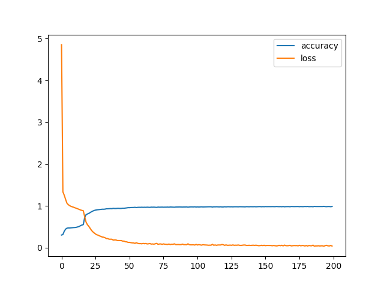
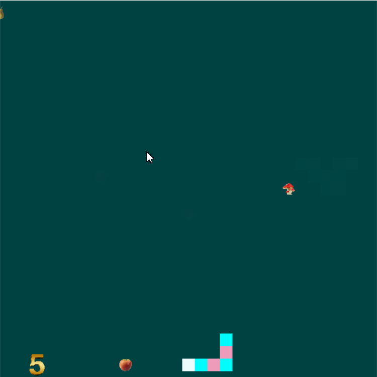

# Snake 🐍
arcade library for the game.
## How to install
for install run following commends:
```
pip install -r requirements.txt
```
## How to run
1. First,you need to run the (***collect_dataset.py***) file to creat the dataset.
2. After creating the dataset, run file (***train.py***) to make the mode fit.
3. Now the model is ready to use and starts playing the AI by running file (***inference.py***) .
## Result

---

